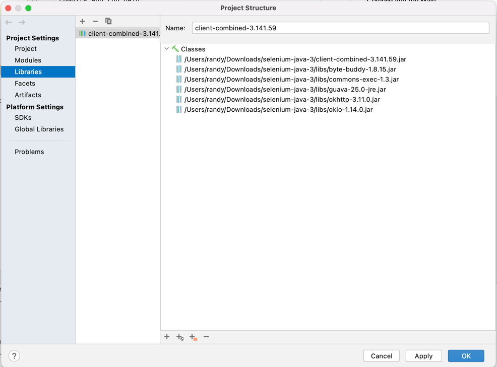

### To Install

Clone the repo, then go to:

[Selenium WebDriver Downloads Page](https://www.selenium.dev/downloads/)

1. Download the latest Java binary
2. Unzip the download
3. Add one of the Selenium jars to your class path
4. Open the `lib` folder
5. Add all the jars found there to your class path

Compile and run Main.

For me, step 3 through 5 look like this:

###### Note: if you don't use IntelliJ, you should

Click :

Select _Libraries_ on the left:

Click the plus sign and select Java:

Navigate to the downloaded/expanded zip folder and select one of the two Selenium jar files.

Then, click the plus sign at the bottom and navigate to the libs folder of the download. Shift select all jars in the folder. When complete the dialog should look like this:

Compile/Run Main from the IDE.
